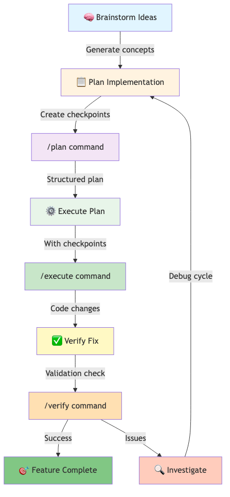
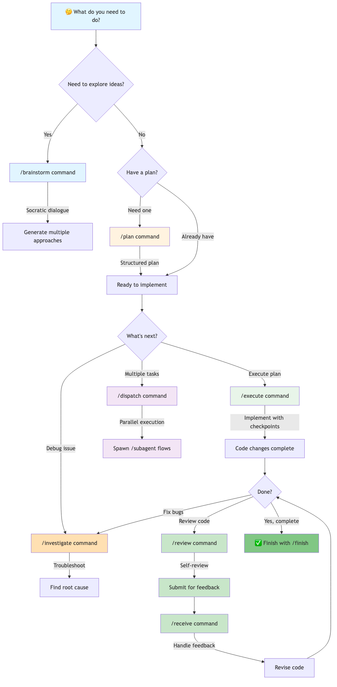
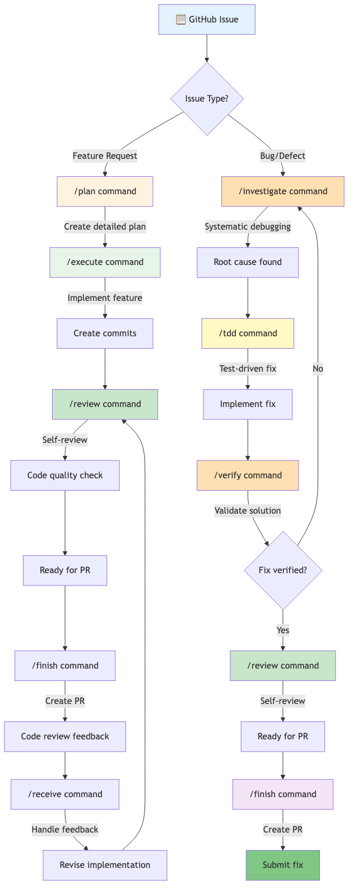
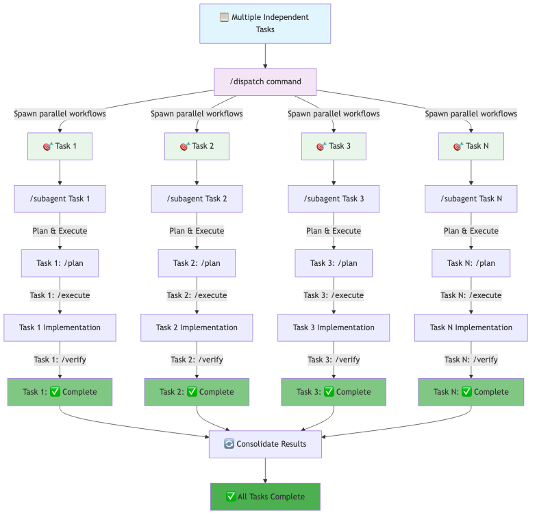
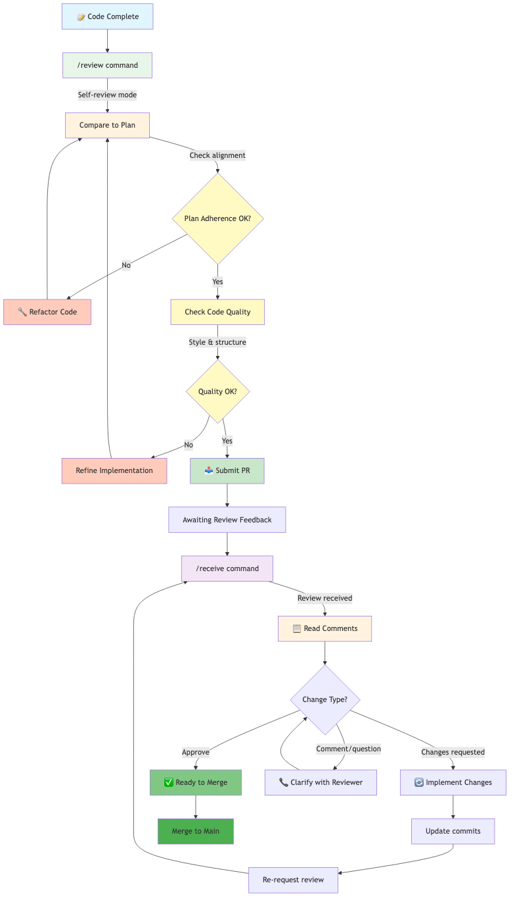
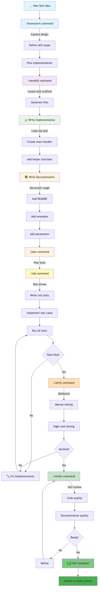

# Gemini Superpowers Cheatsheet

This cheatsheet provides a quick reference for all available Gemini Superpowers slash commands.

## Available Commands

- `/plan`: Create a detailed implementation plan.
- `/execute`: Execute an implementation plan task-by-task.
- `/brainstorm`: Refine ideas through Socratic dialogue.
- `/tdd`: Implement code using strict Red-Green-Refactor.
- `/investigate`: Perform systematic root-cause analysis.
- `/verify`: Verify fixes before signing off.
- `/worktree`: Create isolated git worktree for features.
- `/finish`: Merge, PR, or discard current branch.
- `/review`: Request a self-correction code review.
- `/receive`: Respond to code review feedback.
- `/subagent`: Dispatch subagents for rapid development.
- `/dispatch`: Run parallel subagent workflows.
- `/newskill`: Create a new Superpowers skill.
- `/superpowers`: Learn about available Superpowers.

## Visual Workflows

These diagrams illustrate the core development workflows supported by Gemini Superpowers.

### Core Development Workflow

The fundamental flow: brainstorm ideas, create a plan, execute it, and verify the results.



### Debugging & Troubleshooting Workflow

Systematic approach to debugging: investigate issues, apply Test-Driven Development, and verify fixes.


### Decision Tree

Flowchart to help you choose the right slash command for your current task.



### GitHub Issues Workflow

Demonstrates how to handle feature requests and bug fixes: from GitHub issue to completed merge.



### Parallel Development Workflow

Use `/dispatch` to spawn multiple `/subagent` workflows for independent tasks working in parallel.



### Code Review & Refinement Workflow

Self-review your code with `/review`, then handle feedback with `/receive`.



### Skill Creation & Documentation Workflow

Create new Superpowers skills with `/newskill`, implement, document, test, and verify.



## Usage Examples

- To create a new plan: `/plan "Implement user authentication"`
- To start Test-Driven Development: `/tdd "Add a new API endpoint for user profiles"`
- To investigate a failing test: `/investigate "Test 'user_login_fails' is red"`

## Working with Multiple Repositories

By default, Gemini CLI operates within the current working directory. To allow Gemini to access and understand files from other directories or repositories, use the `--include-directories` argument. This is especially useful when your task involves code spread across different projects.

You can specify multiple directories by separating them with commas, or by using the argument multiple times:

```bash
gemini --include-directories /path/to/repo1,/path/to/repo2 /plan "Develop a feature spanning repo1 and repo2"
# Or
gemini --include-directories /path/to/repo1 --include-directories /path/to/repo2 /plan "Develop a feature spanning repo1 and repo2"
```

This tells Gemini to include the specified directories in its context, allowing it to read and analyze files within them.
